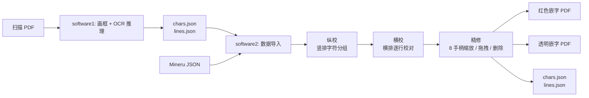

# PDF-OCR

> 一句话简介：基于 PyQt6 + RapidOCR / PaddleOCR PP-OCRv5 的可视化 PDF 字符级 OCR 校对工具，专为扫描书页 PDF（含横排现代书籍与竖排古籍）设计。

PDF-OCR 将「画框 OCR 识别」「字符级纵校 / 横校」「精修嵌字输出 PDF」三个原本割裂的环节整合为一条可视化流水线，并提供 software1（画框 + OCR 推理）与 software2（校对 + 精修输出）两个 Python 版本，便于从快速验证到端到端落地。

---

## 项目亮点

- **双版本并存，覆盖原型与精修**：`software1/`（Python）承担画框 + OCR 推理，`software2/`（Python）承担数据校对与精修输出，两者通过 `chars.json` / `lines.json` 串联为一条完整流水线。
- **字符级 OCR 校对**：不仅识别整行文本，还按字符粒度给出 `box` 与 `score`，可在「纵校」中按字符分组检查、在「精修」中按字符拖拽 / 缩放 / 右键删除。
- **纵校 + 横校双模式**：「纵校」面向竖排文本（古籍、竖排书页），按字符分组逐字校对；「横校」面向横排文本（现代书籍），按行查看与编辑。两阶段配合可处理混合排版。
- **可视化精修窗口**：8 手柄缩放、拖拽移动、右键删除，所见即所得地调整字符位置与文字内容，输出红色 / 透明两种嵌字 PDF。
- **懒加载 + LRU 缓存**：`LazyPageLoader` 按 `(page, zoom)` 缓存渲染后的页面图像，大 PDF 也能流畅翻页。
- **GPU 加速 OCR 推理**（software1）：基于 `paddlepaddle-gpu` + `onnxruntime` + PaddleOCR PP-OCRv5，可启用 CUDA / cuDNN 加速。
- **Mineru / 自产 JSON 双向兼容**：software2 既可加载 software1 输出的 `chars.json` / `lines.json`，也可加载 Mineru 处理流程产出的 JSON。
- **JSON 满足 BC 范式**：`lines.json` 与 `chars.json` 关系模式均无传递依赖、部分依赖，满足 BCNF（详见 `technical_report.md` §6）。

---

## 截图

> 截图待补充。建议放置位置：

- `docs/screenshot_import.png` — 导入阶段（software2）
- `docs/screenshot_vertical.png` — 纵校阶段（竖排古籍）
- `docs/screenshot_horizontal.png` — 横校阶段（横排现代书）
- `docs/screenshot_refine.png` — 精修阶段（8 手柄缩放 + 嵌字预览）
- `docs/screenshot_drawbox.png` — software1 画框 + OCR 准备

---

## 技术栈

### software1（`software1/`）— 画框 + OCR 推理

- **GUI**：PyQt6
- **PDF**：PyMuPDF (`fitz`)
- **OCR**：RapidOCR + PaddleOCR PP-OCRv5（`paddlepaddle-gpu` + `onnxruntime>=1.19`）
- **图像**：Pillow
- **输出**：reportlab（PDF）、JSON

### software2（`software2/`）— 校对 + 精修

- **GUI**：PyQt6
- **PDF**：PyMuPDF
- **图像**：Pillow
- **输出**：reportlab（红 / 透明嵌字 PDF）、JSON
- **注意**：software2 不直接依赖 OCR 推理框架，仅消费 software1 或 Mineru 产出的 JSON 进行数据校对。

### OCR 引擎

- **PaddleOCR PP-OCRv5**：software1 实际调用的推理后端，支持中文 / 英文 / 多语言
- **RapidOCR**：software1 的 Python 推理封装，提供 `return_word_box` 与 `return_single_char_box` 字符级输出

---

## 架构

### 整体流水线



### 应用内数据流（以 software2 为例）

```
ImportWindow
  → (page_images, ocr_results, char_slices)
  → VerticalCheckWindow
  → (updated char_slices, updated ocr_results)
  → HorizontalCheckWindow
  → (corrected_lines)
  → RefineWindow
  → (red_pdf_path, transparent_pdf_path)
```

主窗口 `MainWindow` 持有 `QStackedWidget`，按阶段切换子窗口；阶段间通过 Qt 信号传递数据，窗口之间无直接引用。

### 模块划分

| 模块 | software2 | 职责 |
|------|-----------|------|
| PDF 处理 | `pdf_processor/pdf_loader.py` | PDF → 图像 |
| 懒加载 | `pdf_loader.LazyPageLoader` | 按 `(page, zoom)` LRU 缓存 |
| OCR 引擎 | `ocr_engine/rapidocr_engine.py` | JSON 加载、字符分组、行数据构建 |
| PDF 输出 | `pdf_processor/pdf_output.py` | 校对后 PDF 生成（红 / 透明） |
| 数据模型 | `models/data_models.py` | dataclass 与 JSON 序列化 |
| UI 主窗口 | `main.py` | 阶段调度 |
| UI 阶段窗口 | `ui/*.py` | 各阶段交互界面 |
| 样式 | `ui/styles.py` | QSS 样式表 |
| 缩放 | `ui/zoom_utils.py` | 滚轮缩放计算 |
| 步骤指示器 | `main.py:StepIndicator` | 顶部阶段进度条 |

### 线程模型

| 场景 | software2 |
|------|-----------|
| PDF 导入 | `ImportWorker(QObject)` + `moveToThread()` |
| PDF 输出 | `PDFOutputWorker(QThread)` 重写 `run()` |
| 横校数据构建 | 主线程同步 `build_line_data` |

---

## 两个版本说明

| 版本 | 路径 | 语言 | 流程阶段 | 角色 |
|------|------|------|----------|------|
| **software1** | `software1/` | Python / PyQt6 | 画框 → OCR 准备 | 基础版，含完整 OCR 推理（RapidOCR + PP-OCRv5） |
| **software2** | `software2/` | Python / PyQt6 | 导入 → 纵校 → 横校 → 精修 | 增强版，仅做数据校对与 PDF 输出 |

> software1 + software2 可串联使用：software1 负责把 PDF 跑成 `chars.json` / `lines.json`，software2 加载这些 JSON 进行校对与精修输出。

---

## 安装与运行

### software1（画框 + OCR 推理）

```bash
cd software1
pip install -r requirements.txt
python main.py
```

依赖（`software1/requirements.txt`）：

```
numpy<2
onnxruntime>=1.19.0
PyQt6
PyMuPDF
reportlab
Pillow
paddlepaddle-gpu
rapidocr
```

启用 GPU：确保已安装匹配 CUDA / cuDNN 版本的 `paddlepaddle-gpu`，并配置 `PATH` 包含 `cudnn64_*.dll`、`cudart64_*.dll`。

### software2（校对 + 精修，推荐）

```bash
cd software2
pip install -r requirements.txt
python main.py
```

依赖（`software2/requirements.txt`）：

```
numpy<2
PyQt6
PyMuPDF
reportlab
Pillow
paddlepaddle-gpu
```

> software2 自身不调用 OCR 推理，`paddlepaddle-gpu` 在 software2 中并非必需，可按需精简。

---

## 使用流程

### software1：画框 + OCR 推理

1. **打开 PDF**：选择扫描书页 PDF，自动渲染首页。
2. **画框阶段**：在页面上拖拽绘制矩形框，框选要 OCR 的区域。
3. **OCR 准备阶段**：调整 OCR 参数（语言、是否启用字符级 box、GPU / CPU），点击「开始识别」。
4. **输出**：识别结果写入 `chars.json` 与 `lines.json`，存放在 PDF 同级目录。

### software2：校对 + 精修

1. **导入阶段**：选择 PDF 文件，自动检测同目录下的 `lines.json` 与 `newchar.json` / `chars.json`。点击「加载」后并行执行 PDF → 图像、JSON 加载、字符分组三步。
2. **纵校阶段**（竖排文本）：按字符内容分组，逐组检查识别结果。可修改文字、删除错误字符、新增字符；切换字符组时自动刷新预览。
3. **横校阶段**（横排文本）：按行查看页面图像 + 行文本，支持滚轮缩放、悬停预览切片、修改文字、删除整行。
4. **精修阶段**：8 手柄缩放 + 拖拽移动 + 右键删除，所见即所得地调整字符位置与文本。点击「输出 PDF」生成两个文件：
   - `<原文件名>_红色.pdf` — 红色文字版，便于校对审查
   - `<原文件名>_透明.pdf` — 透明文字版，可作为最终嵌字 PDF
5. **结果**：校对完成的字符 / 行数据可回写为 `chars.json` 与 `lines.json`。

---

## 输出格式

### `lines.json`（行级）

```json
{
  "line_id": 0,
  "page_num": 0,
  "text": "智慧工地技术",
  "score": 0.99988,
  "box": [[529.53, 437.16], [991.18, 437.16], [991.18, 521.64], [529.53, 521.64]]
}
```

| 字段 | 类型 | 说明 |
|------|------|------|
| `line_id` | int | 行 ID，页内唯一 |
| `page_num` | int | 所在页码（0-based） |
| `text` | string | 行文本 |
| `score` | float | 行级识别置信度 |
| `box` | `[[x,y],...]` | 行四角坐标 |

候选键 `(page_num, line_id)`，满足 BCNF。

### `chars.json` / `newchar.json`（字符级）

```json
{
  "char_id": 0,
  "line_id": 0,
  "page_num": 0,
  "char": "智",
  "score": 0.99,
  "box": [x1, y1, x2, y2]
}
```

| 字段 | 类型 | 说明 |
|------|------|------|
| `char_id` | int | 字符 ID，行内唯一 |
| `line_id` | int | 所属行 ID |
| `page_num` | int | 所在页码 |
| `char` | string | 字符内容 |
| `score` | float | 字符级识别置信度 |
| `box` | `[x1, y1, x2, y2]` | 字符矩形框 |

候选键 `(page_num, line_id, char_id)`，满足 BCNF。

> `newchar.json` 与 `chars.json` 字段结构一致，前者表示「经过纵校修改后的最新字符结果」，导入时优先于 `chars.json`。

---

## FAQ

**Q1：OCR 识别不准怎么办？**
先在 software1 的「OCR 准备」阶段调整参数（启用字符级 box、切换 PP-OCRv5 模型、检查 GPU 是否真的启用），再在 software2 的纵校与横校阶段手工修正。识别置信度低的字符可在纵校中按字符分组批量复查。

**Q2：支持哪些语言？**
继承 PaddleOCR PP-OCRv5 的语言能力，主要面向中文（简 / 繁）与英文。其他语言需在 software1 替换对应模型。

**Q3：必须用 GPU 吗？**
不是。software1 可在 CPU 模式下运行（移除 `paddlepaddle-gpu`，改用 `paddlepaddle`），但推理速度会显著下降。software2 完全不依赖 GPU，纯 CPU 即可。

**Q4：software2 加载 JSON 报「未检测到 lines.json」？**
software2 默认从 PDF 所在目录自动检测 `lines.json` 与 `newchar.json` / `chars.json`。请确认这些 JSON 与 PDF 在同一目录，且文件名严格匹配。Mineru 产出的 JSON 需先用 software1 或脚本转换为 `lines.json` + `chars.json` 命名。

**Q5：纵校修改后关闭程序会丢失吗？**
当前 software2 的纵校与横校修改仅保存在内存中，关闭程序即丢失。如需保留，请在精修阶段输出 PDF，或手动将内存中的 `char_slices` / `ocr_results` 写回 JSON（后续迭代计划引入 SQLite 持久化）。

---

## 与 TRAE 的结合

本项目使用 **TRAE IDE** 进行开发，主要在以下环节获得 TRAE 的协助：

- **代码理解与跨文件追踪**：software1 / software2 两版本共数百个源文件，借助 TRAE 的语义检索能力快速定位「纵校修改如何传递到精修」等跨模块问题。
- **bug 定位与修复**：技术报告 §3.1 列出的横校 pixmap 缓存被整体替换等问题，均通过 TRAE 的代码审查与上下文分析定位。
- **重构建议**：在开发与重构过程中，TRAE 协助识别重复代码（`pdf_loader.py` / `styles.py` / `zoom_utils.py`）并生成迁移计划。
- **计划与规格驱动开发**：所有功能改造均按 `.trae/specs/<feature>/{spec,tasks,checklist}.md` 三段式记录，便于复盘与协作。

---

## 已知限制

- **校对结果未持久化**：纵校 / 横校修改仅在内存中，关闭程序即丢失。后续计划引入 SQLite 或 JSON 写回。
- **software1 与 software2 代码重复**：`pdf_loader.py`、`styles.py`、`zoom_utils.py` 在两个版本中近乎一致，后续应抽取公共子模块。

---

## License

本项目为内部工具，沿用原 Python 版本相同的所有权与授权条款。如需商业使用请联系作者。

---

## 致谢

- [PaddleOCR](https://github.com/PaddlePaddle/PaddleOCR) / [RapidOCR](https://github.com/RapidAI/RapidOCR) — OCR 推理引擎
- [PyQt6](https://www.riverbankcomputing.com/software/pyqt/) / [Qt](https://www.qt.io/) — GUI 框架
- [PyMuPDF](https://pymupdf.readthedocs.io/) — PDF 解析与渲染
- [reportlab](https://www.reportlab.com/) — Python PDF 生成
- [Mineru](https://github.com/opendatalab/Mineru) — JSON 数据来源之一
